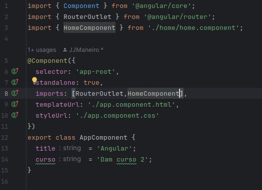
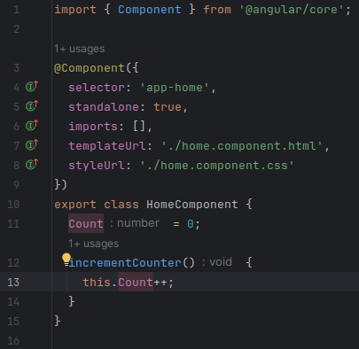
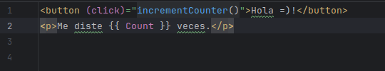
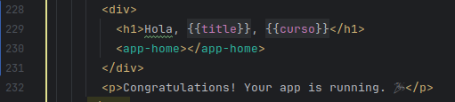
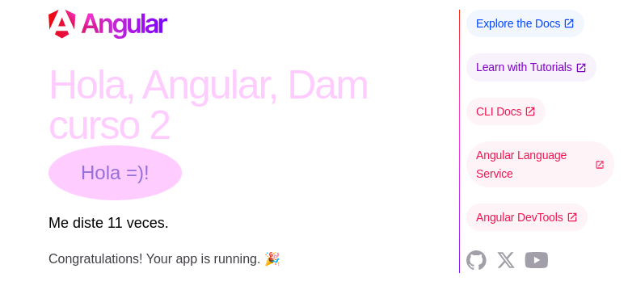

# Prueba sencilla: Botón de angular.
## Como se hizo el botón.
Una vez haya puesto el componente de la clase del botón en la fila 
app.component.ts del proyecto de Angular.
 

Inserté en la export class de la clase del componente
un contador que incremente a cada vez que haga click al botón.
 

Tras esto fui al html para hacer el botón y enlazarle la función anteriorhecha.
Esta te dice cuantas veces le hiciste click.
 

Para darle una apariencia más bonita, lo hice un óvalo en css.
 

Por último lo integre en el app.component html del proyecto de Angular.
 

---
## Resultado de la pagina web:

